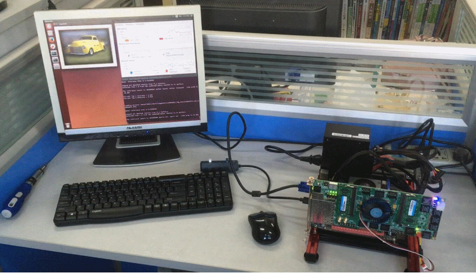

# PipeCNN

## About 
**PipeCNN** is an OpenCL-based FPGA Accelerator for Large-Scale Convolutional Neural Networks (CNNs).
There is a growing trend among the FPGA community to utilize High Level Synthesis (HLS) tools to design
and implement customized circuits on FPGAs. Compared with RTL-based design methodology, the HLS tools provide faster hardware development
cycle by automatically synthesizing an algorithm in high-level languages (e.g. C/C++) to RTL/hardware. [OpenCL™](https://www.khronos.org/opencl/) is an open, emergying cross-platform parallel programming language that can be used in both GPU and FPGA developments. The main goal of this project is to provide a generic, yet efficient OpenCL-based design of CNN accelerator on FPGAs. Our design is scalable both in performance and hardware resource, and thus can be deployed on a variety of FPGA platforms.

## How to Use

First, download the pre-trained CNN models, input test vectors and golden reference files from PipeCNN's own [ModelZoo](https://github.com/doonny/PipeCNN/tree/master/data). Place the data in the correct folder. Compile the project by using the Makefile provided. After finishing the compilation, simply type the following command to run PipeCNN:
```
./run.exe conv.aocx
```
For users who are using Xilinx's SDx environments, it is recommended to use the IDE instead of makefiles. Currently, only Intel's OpenCL SDK v16.1 and Xilinx's SDAccel v2017.2 are supported. Please carefully read the [User Instructions](https://github.com/doonny/PipeCNN/tree/master/documents) before using.

## Boards and Performances
Currently, we use [Intel's OpenCL SDK](https://www.altera.com/products/design-software/embedded-software-developers/opencl/overview.html) v16.1 toolset for compilation of the OpenCL code and implementation of the generated RTL on Altera's FPGAs. For Xilinx FPGAs, the [SDAccel](https://www.xilinx.com/products/design-tools/software-zone/sdaccel.html) development environment v2017.2 can be used. PipeCNN has been tested and evaluated on the following FPGA boards/platforms. Noting that SDSoC has not been fully tested, and if you have any results, please kindly email us the latest updates.

The following boards have been tested by using Intel OpenCL SDK v16.1:
* Terasic's [DE5-net](http://www.terasic.com.cn/cgi-bin/page/archive.pl?Language=China&CategoryNo=179&No=727) (Stratix-V A7 FPGA)
* Terasic's [DE5a-net](http://www.terasic.com.cn/cgi-bin/page/archive.pl?Language=China&CategoryNo=251&No=988) (Arria-10 1150 FPGA)
* Terasic's [DE1-soc](http://www.terasic.com.cn/cgi-bin/page/archive.pl?Language=China&CategoryNo=180&No=870) (Cyclone-V SEA5 FPGA)
* Terasic's [DE10-standard](http://www.terasic.com.cn/cgi-bin/page/archive.pl?Language=China&CategoryNo=180&No=1105) (Cyclone-V SXC6 FPGA)
* Speed-Clouds' [SC-IMB+SC-VMB](http://speed-clouds.com/index.php?c=news&a=page&id=74) (Arria-10 SX480)

The following boards have been tested by using Xilinx SDAccel v2017.2:
* Xilinx's [KCU1500](https://www.xilinx.com/products/boards-and-kits/dk-u1-kcu1500-g.html) (XCKU115 FPGA)

This following table lists the performance and cost information on some of the boards we used as a reference. For each FPGA device, one needs to perform design space exploration (with hardware parameters VEC_SIZE, LANE_NUM and CONV_GP_SIZE_X) to find the optimal design that maximizes the throughput or minimizes the excution time. Suggested hardware parameters for the above boards are summarized [here](https://github.com/doonny/PipeCNN/tree/master/documents). Since we are constantly optimzing the design and updating the codes, the performance data in the following table might be out-dated, and please use the latest version to get the exect data. We welcome other vendors/researches to provide the latest performance and cost information on other FPGA platforms/boards.

| Boards     | Excution Time* | Batch Size | DSP Consumed |  Frequency|
| :--------: |--------------:| ----------:| ------------:|----------:|
| DE1-soc    |         150ms |          1 |            68|     122MHz|
| DE5-net    |          15ms |         16 |           228|     206MHz|

*Note: AlexNet was used as the benchmark. Image size is 227x227x3.

## Demos
Now you can run ImageNet classification on PipeCNN, and measure the top-1/5 accuracy on your own dataset.

First, set **USE_OPENCV = 1** in the Makefile. Secondly, download the ImageNet validation dataset, extract and place all the pictures in the "/data" folder. Rename the variable "picture_file_path_head" in the host file to indicate the correct image data set path. Finally, recompile the host program and run PipeCNN.

The following piture shows that the demo runs on our own computer with the DE5-net board.



## Update Plans
* Support for sparse or Winograd-based convolution algorithms.
* Implementation of Faster-RCNN and YOLO9000.

## Citation
Please kindly cite our work of PipeCNN if it helps your research:
```
Dong Wang, Ke Xu and Diankun Jiang, “PipeCNN: An OpenCL-Based Open-Source FPGA Accelerator for Convolution Neural Networks”, FPT 2017.
```


## Related Works
There are other FPGA accelerators that also adopt HLS-based design scheme. Some brilliant works are listed as follow. Note that PipeCNN is the first, and only one that is Open-Source （￣︶￣）↗
* U. Aydonat, S. O'Connell, D. Capalija, A. C. Ling, and G. R. Chiu. "An OpenCL™ Deep Learning Accelerator on Arria 10," *in Proc. FPGA 2017*.
* N. Suda, V. Chandra, G. Dasika, A. Mohanty, Y. F. Ma, S. Vrudhula, J. S. Seo, and Y. Cao, "Throughput-Optimized OpenCL-based FPGA accelerator for large-scale convolutional neural networks," *in Proc. FPGA 2016*.
* C. Zhang, P. Li, G. Sun, Y. Guan, B. J. Xiao, and J. Cong, "Optimizing FPGA-based accelerator design for deep convolutional neural networks," *in Proc. FPGA 2015*.
